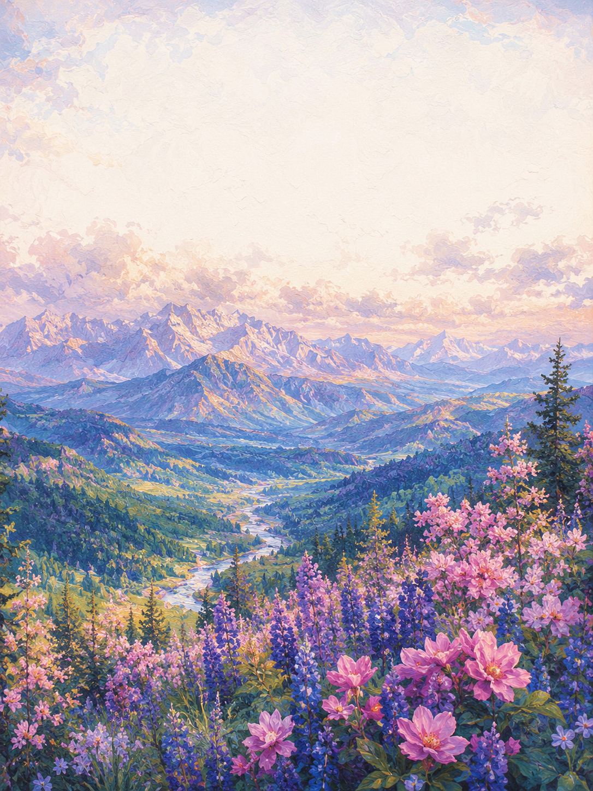

  

  

 

 
 

 

---

## About

From what I have observed so far, people easily adapt to the standards of the environment they belong to.

Even standards that once seemed insufficient can become familiar over time, and at some point, people may begin to accept those standards as their own limits.

But the level of my surrounding environment should not become my standard.

The limits of the group I belong to should not become the limits of who I am.

If one stays inside the well for too long, it becomes difficult to imagine the size of the world outside.

Staying inside the shell may feel safe, but to be born, the shell must eventually be broken.

This independent learning process began from that awareness.

It was not created to simply follow a given curriculum, but to rebuild the foundations I found lacking on my own terms.

I created this process to avoid becoming accustomed to low standards, to measure myself again by standards beyond a familiar environment, and to move further than the limits of the place I currently belong to.

 

  

 

---

 
 

<i>Let’s all become mavericks!</i>

 
 

  

